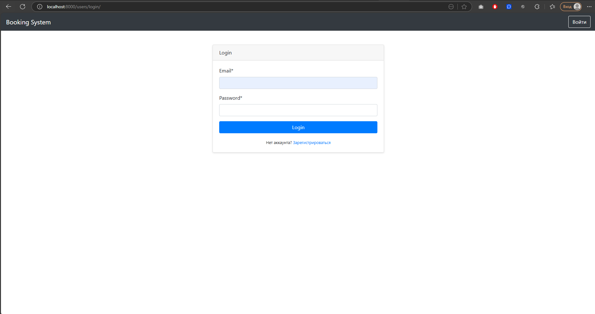
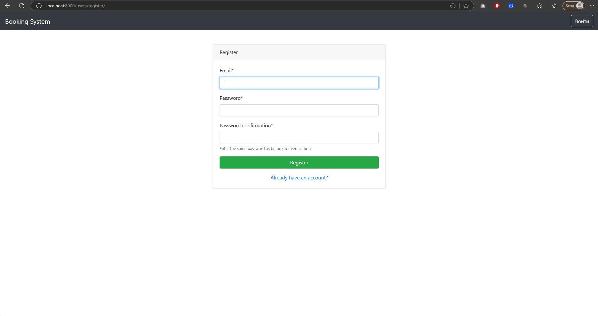
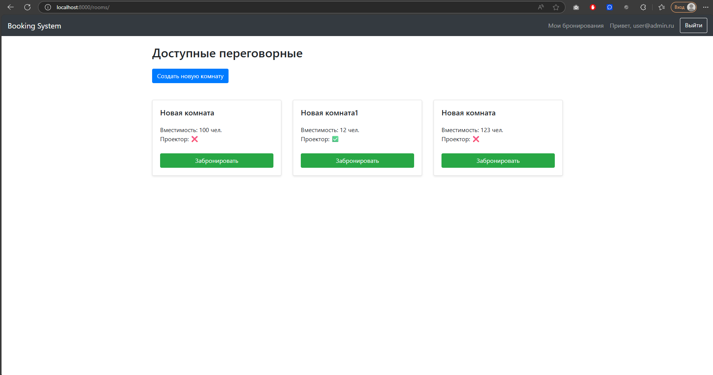
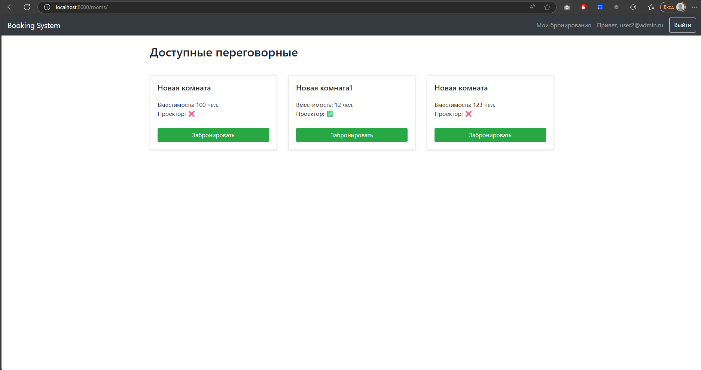
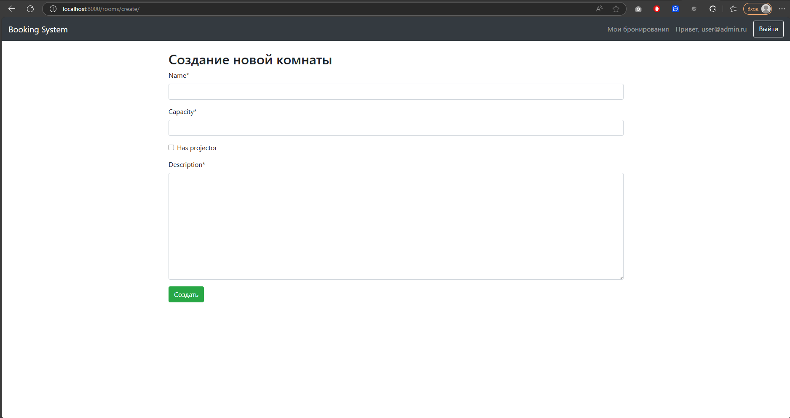
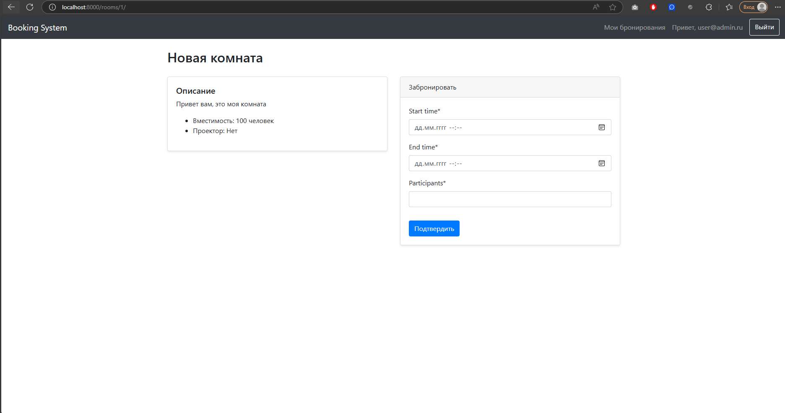
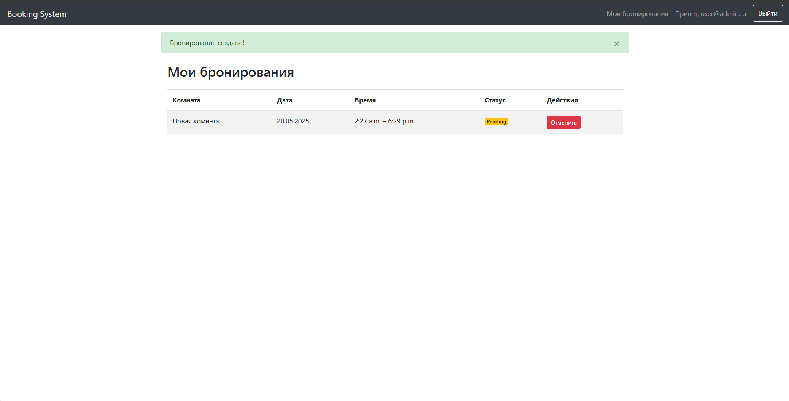

# Система бронирования переговорных комнат

Проект позволяет пользователям бронировать переговорные комнаты, просматривать свои бронирования и управлять ими. Администраторы могут добавлять новые комнаты, редактировать существующие и контролировать активность пользователей.

## Основные функции

- **Регистрация и авторизация пользователей**  
  Пользователи могут создавать аккаунты и входить в систему через email.
- **Просмотр списка доступных комнат**
- **Бронирование комнаты**  
  Выбор даты и времени бронирования с проверкой на конфликты.
- **Управление бронированиями**  
  Просмотр, отмена бронирований.
- **Администрирование**  
  Добавление комнат через админ-панель.

## Технологии

- **Backend**: Django 5.2, PostgreSQL
- **Frontend**: Bootstrap 5, Crispy Forms
- **Дополнительно**: Celery (асинхронные задачи), Redis (кеширование), Sentry (мониторинг ошибок)

## Установка и настройка

1. **Клонируйте репозиторий**:
   ```bash
   git clone https://github.com/fa2fin/conference_room_booking.git
   cd conference-room-booking
    ```
2 **Создайте виртуальное окружение**:

 ```bash
python -m venv .venv
source .venv/bin/activate  # Linux/macOS
.venv\Scripts\activate     # Windows
 ```
3 **Установите зависимости**:

 ```bash
pip install -r requirements.txt
 ```
4 **Настройте переменные окружения**

Создайте файл .env в корне проекта:
 ```bash
SECRET_KEY=your_django_secret_key
 ```
5 **Настройте параметры подключения к базе данных PostgreSQL**

В файле conference_room_booking/setting.py необходимо указать свои логин, пароль и порт подключения к базе данных


6 **Выполните миграции**:

 ```bash
python manage.py makemigrations rooms
python manage.py makemigrations users
python manage.py makemigrations bookings
python manage.py migrate
 ```

6 **Создайте администратора/суперюзера**:
 ``` bash
python manage.py createsuperuser
 ```

7 **Запустите сервер**:

 ``` bash
python manage.py runserver
 ```
8 **Адрес для использования**:
 ``` bash
http://localhost:8000/users/login/
 ```

7 **Примеры использования**:

Окно для логина



Окно для регистрации




Окно админки, доступно создание комнаты



Окно обычного юзера



Окно создания новой комнаты



Окно для бронирования 



Окно с бронированиями конкретного пользователя



Бронирование комнаты

Перейдите на страницу комнаты.

Укажите дату и время бронирования.

Подтвердите бронь. Если время свободно, бронирование будет создано.

Админ-панель
Доступна по адресу /admin/. Требуются права суперпользователя:
